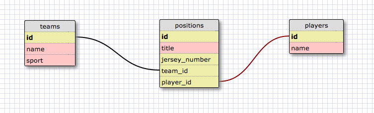

# Part 4: SQL Queries
## Summary
In this part of the assessment you will be working with the provided SQL database
`directory.sqlite` to demonstrate your ability to construct queries. The schema
(image below) is made up of three tables, `teams`, `players`, and `positions`.



To get started open a SQLITE session in the console with the following command (note: assuming in the part-4 directory)

```bash
$ sqlite3 directory.sqlite
```

## Releases
### Release 0: `SELECT`
In your terminal, create and execute the following queries:
- show all the teams
- show all the players
- show all the positions

Copy the terminal output (both your query and the results) and paste the results into the `part-4/queries.md` file.

### Release 1: `WHERE`
In your terminal, create and execute the following queries:
- show all the teams containing "United States" in the name
- show the players with a name starting with "J"

Copy the terminal output (both your query and the results) and paste the results into the `part-4/queries.md` file.

### Release 2: `JOIN`
In your terminal, create and execute the following queries:
- show all the players on the "Cleveland Cavaliers" team
- show all the players who play on a "Soccer" team
- show all the teams with a position called "Forward"
- show all the teams the player "Shannon Boxx" plays for

Copy the terminal output (both your query and the results) and paste the results into the `part-4/queries.md` file.

### Release 3: `INSERT`
In your terminal, create and execute the following queries:
- add a new player to the players table
- add a new team to the teams table
- add a new position to the positions table with the new player and team

Copy the terminal output (both your query and the results) and paste the results into the `part-4/queries.md` file.

### Release 4: `UPDATE`
In your terminal, create and execute the following queries:
- update the player named "Hope Solo" to "Hope Amelia Solo"

Copy the terminal output (both your query and the results) and paste the results into the `part-4/queries.md` file.

### Release 5: `DELETE`
In your terminal, create and execute the following queries:
- Delete the player created in Release 3
- Delete the team created in Release 3
- Delete the position created in Release 3

Copy the terminal output (both your query and the results) and paste the results into the `part-4/queries.md` file.

## Conclusion
You are done with part-4. If you have not committed your changes, please do so before moving onto part-5.
